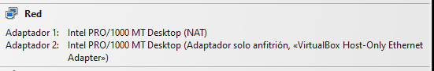
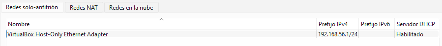
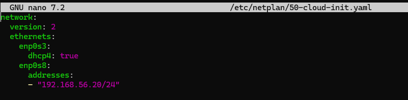
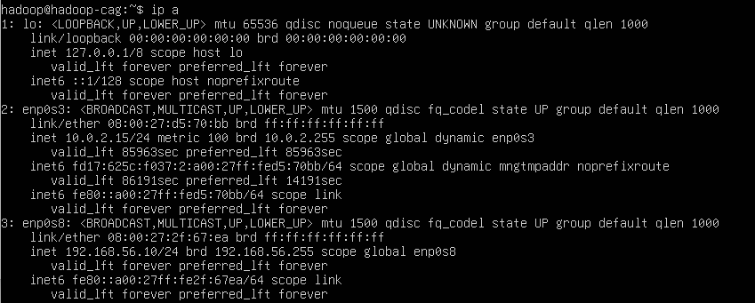
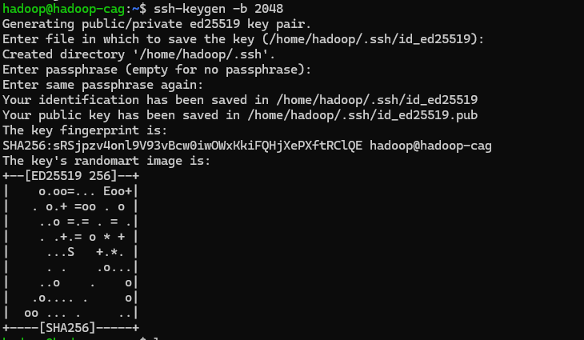
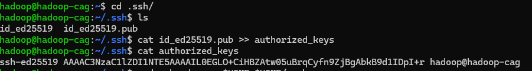
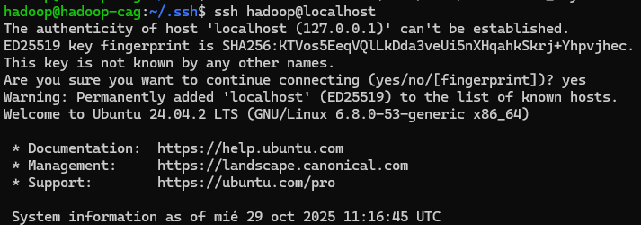
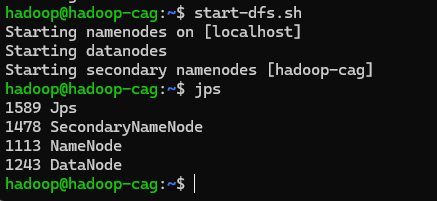

## PR0201: Instalación y configuración de Hadoop en modo pseudo-distribuido
### 1. Configurar los adaptadores de red de la máquina virtual y asignar la IP solicitada.
Tenemos un adaptador NAT y otro solo anfitrión

Este es nuestro adaptador de red solo anfitrión

Asignamos nuestra ip(192.168.56.10) editando el archivo .yaml con el comando: `sudo nano /etc/netplan/50-cloud-init.yaml`

### 2. Cambiar el nombre del host a hadoop-{iniciales}.
Cambiamos el nombre de host editando el archivo hostame con el comando: `sudo nano /etc/hostname`

### 3. Configurar acceso SSH mediante claves.
Creamos un par de claves publica-privada

Almacenamos la clave publica en un fickero llamado authorized_keys

Asignamos permisos al fichero authorized_keys para que solo pueda acceder a ella el usuario hadoop

Comprobar

### 5. Configurar Hadoop en modo pseudo-distribuido.
```nano .bashrc```
```. ./.bashrc```

```nano /opt/hadoop/etc/hadoop/hadoop-env.sh```

### 6. Iniciar los servicios de Hadoop y verificar su funcionamiento.
Iniciamos Hadoop con el comando `start-dfs.sh` y comprobamos con `jps`

Entramos en la interfaz web
