# PR0202: Uso del cliente HDFS

<!-- 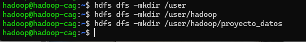 --> <!-- mostrar imagenes -->

1. Preparación del entorno

- Crea un directorio personal en HDFS bajo /user con tu nombre de usuario y dentro de él un directorio llamado proyecto_datos.

`hdfs dfs -mkdir /user`

`hdfs dfs -mkdir /user/hadoop/`

`hdfs dfs -mkdir /user/hadoop/proyecto_datos`

2. Carga de datasets

- Descarga el dataset Automotive Price Prediction Dataset que puedes obtener desde Kaggle y que contiene un dataset sintético con información y precio de 1000000 de vehículos de segunda mano

`curl -L -o ~/vehicle-price-prediction.zip\  https://www.kaggle.com/api/v1/datasets/download/metawave/vehicle-price-prediction`

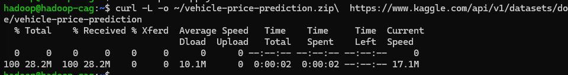

- Desde tu sistema local, sube al directorio proyecto_datos el dataset que has descargado.
  
`unzip vehicle-price-prediction.csv`

`hdfs dfs -put ./vehicle_price_prediction.csv /user/hadoop/proyecto_datos`

`hdfs dfs -ls /user/hadoop/proyecto_datos`

3. Exploración de datos

- Visualiza el contenido del archivo directamente en HDFS.
  
`hdfs dfs -cat /user/hadoop/proyecto_datos/vehicle_price_prediction.csv`

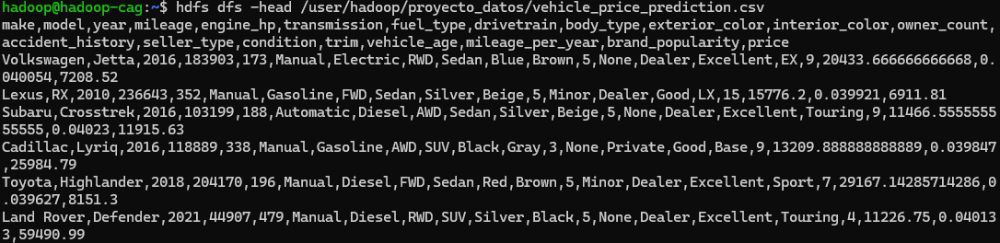

- Obtén el número de líneas del dataset.
  
`hdfs dfs -cat /user/hadoop/proyecto_datos/vehicle_price_prediction.csv | wc -l` 

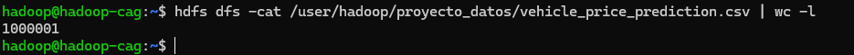

4. Organización del proyecto

- Crea un subdirectorio procesados y otro backup dentro de tu carpeta de proyecto.

`hdfs dfs -mkdir /user/hadoop/proyecto_datos/procesados`

`hdfs dfs -mkdir /user/hadoop/proyecto_datos/backup`

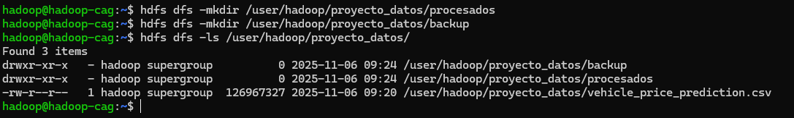

- Copia el archivo original a backup.

`hdfs dfs -cp /user/hadoop/proyecto_datos/vehicle_price_prediction.csv /user/hadoop/proyecto_datos/backup`

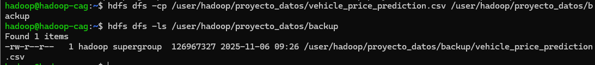

- Mueve el archivo original de proyecto_datos a procesados.

`hdfs dfs -mv /user/hadoop/proyecto_datos/vehicle_price_prediction.csv /user/hadoop/proyecto_datos/procesados`

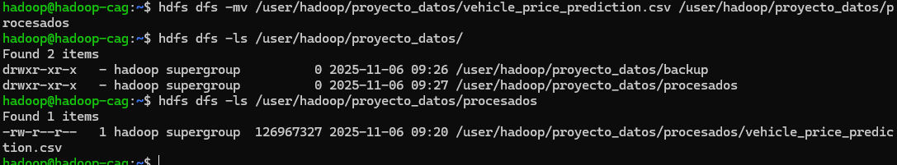

5. Colaboración en el equipo

- Crea un directorio compartido bajo /compartido (si no existe) y copia allí tu dataset para que otros puedan acceder.

`hdfs dfs -mkdir /compartido`

`hdfs dfs -cp /user/hadoop/proyecto_datos/procesados/vehicle_price_prediction.csv /compartido`

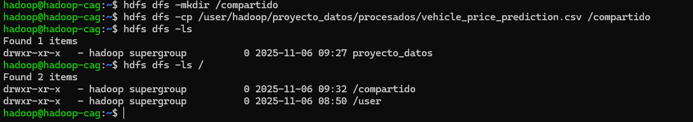

6. Recuperación de datos

- Descarga a tu sistema local el archivo que está en el directorio procesados.

`hdfs dfs -get /user/hadoop/proyecto_datos/procesados/vehicle_price_prediction.csv /opt/hadoop`

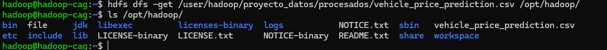

7. Control de accesos

- Verifica los permisos de tus archivos.

`hdfs dfs -ls /user/hadoop/proyecto_datos/procesados/vehicle_price_prediction.csv -l`

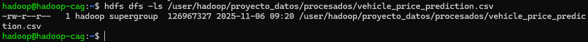

- Cambia los permisos de un archivo de backup para que solo tú tengas acceso de lectura y escritura.

`hdfs dfs -chmod 600 /user/hadoop/proyecto_datos/backup/vehicle_price_prediction.csv`

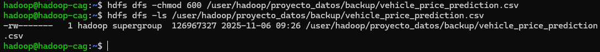

8. Mantenimiento

- Elimina un archivo temporal que hayas subido por error a tu espacio en HDFS.

`hdfs dfs -rm /compartido/arch_temp.csv`

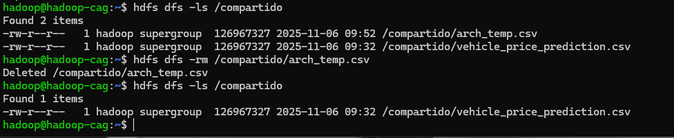

9. (Opcional, avanzado)

- Configura una cuota de número de archivos en tu directorio de proyecto y prueba a superar el límite para observar el comportamiento de HDFS.

`hdfs dfs -mkdir /proyectos`

`hdfs dfsadmin -setQuota 2 /proyectos`

`hdfs dfs -cp /user/hadoop/proyecto_datos/procesados/vehicle_price_prediction.csv /proyectos/arch_te
mp.csv`

`hdfs dfs -cp /user/hadoop/proyecto_datos/procesados/vehicle_price_prediction.csv /proyectos/arch_temp1.csv`

`hdfs dfs -ls /proyectos`

`hdfs dfs -count -q /proyectos`

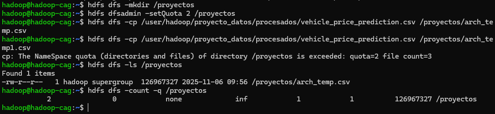
