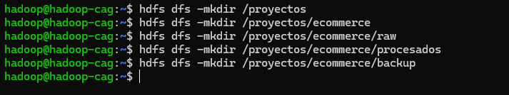
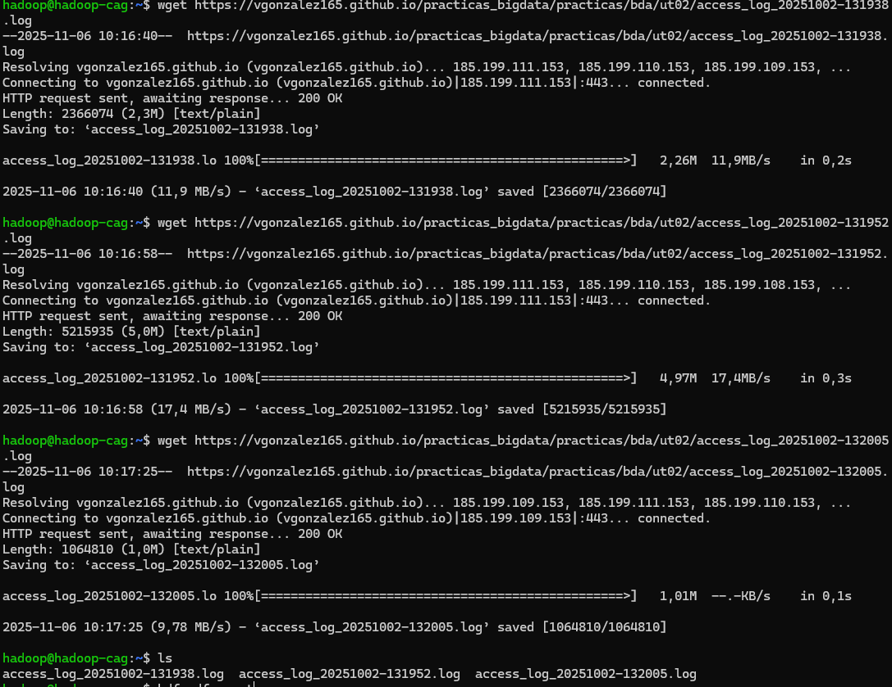
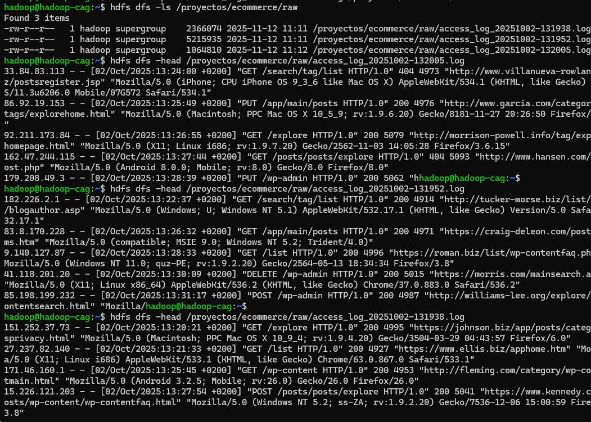
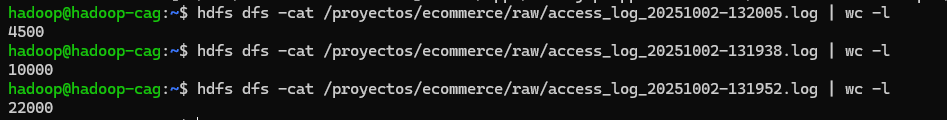
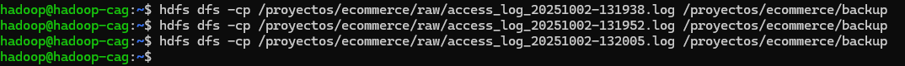
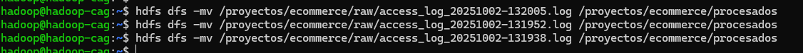
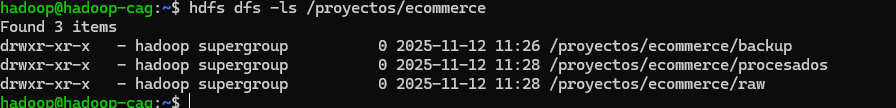
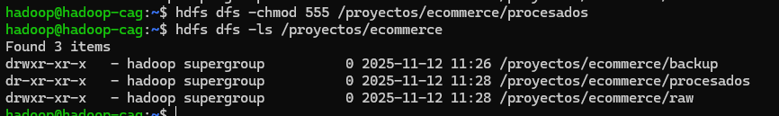
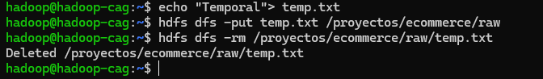

# PR0203: Uso del cliente HDFS (2)
1. Preparación el espacio de trabajo en HDFS

- Crea un directorio principal /proyectos/ecommerce en HDFS.
 
`hdfs dfs -mkdir /proyectos`

`hdfs dfs -mkdir /proyectos/ecommerce`

- Dentro de él, crea tres subdirectorios:
    - /raw → para los logs originales.
      
      `hdfs dfs -mkdir /proyectos/ecommerce/raw`
      
    - /procesados → para los logs ya tratados.

      `hdfs dfs -mkdir /proyectos/ecommerce/procesados`

    - /backup → para copias de seguridad.
 
      `hdfs dfs -mkdir /proyectos/ecommerce/backup`     

2.Carga inicial de logs

- Desde tu sistema local, sube al directorio /raw los siguientes logs de un servidor Web Apache:
    - Fichero de log 1

`wget https://vgonzalez165.github.io/practicas_bigdata/practicas/bda/ut02/access_log_20251002-131938.log`

`hdfs dfs -put ./access_log_20251002-131938.log /proyectos/ecommerce/raw`

    - Fichero de log 2
    
` wget https://vgonzalez165.github.io/practicas_bigdata/practicas/bda/ut02/access_log_20251002-131952.log`

`hdfs dfs -put ./access_log_20251002-131952.log /proyectos/ecommerce/raw`

    - Fichero de log 3

` wget https://vgonzalez165.github.io/practicas_bigdata/practicas/bda/ut02/access_log_20251002-132005.log`

`hdfs dfs -put ./access_log_20251002-132005.log /proyectos/ecommerce/raw`

3.Inspección de datos

- Lista los archivos en /raw y visualiza su contenido.
  
  `hdfs dfs -ls /proyectos/ecommerce/raw`
  
  `hdfs dfs -head /proyectos/ecommerce/raw/access_log_20251002-131952.log`
  
  `hdfs dfs -head /proyectos/ecommerce/raw/access_log_20251002-131938.log`
  
  `hdfs dfs -head /proyectos/ecommerce/raw/access_log_20251002-131938.log`

- Muestra el número total de líneas en cada archivo subido.

  `hdfs dfs -cat /proyectos/ecommerce/raw/access_log_20251002-132005.log | wc -l`
  
  `hdfs dfs -cat /proyectos/ecommerce/raw/access_log_20251002-131938.log | wc -l`
  
  `hdfs dfs -cat /proyectos/ecommerce/raw/access_log_20251002-131952.log | wc -l`
  

4.Organización de los logs

- Copia los archivos de /raw a /backup.
  
  `hdfs dfs -cp /proyectos/ecommerce/raw/access_log_20251002-131938.log /proyectos/ecommerce/backup`
  
  `hdfs dfs -cp /proyectos/ecommerce/raw/access_log_20251002-131952.log /proyectos/ecommerce/backup`
  
  `hdfs dfs -cp /proyectos/ecommerce/raw/access_log_20251002-132005.log /proyectos/ecommerce/backup`

- Mueve los archivos originales de /raw a /procesados.
  
  `hdfs dfs -mv /proyectos/ecommerce/raw/access_log_20251002-132005.log /proyectos/ecommerce/procesados`
  
  `hdfs dfs -mv /proyectos/ecommerce/raw/access_log_20251002-131952.log /proyectos/ecommerce/procesados`
  
  `hdfs dfs -mv /proyectos/ecommerce/raw/access_log_20251002-131938.log /proyectos/ecommerce/procesados`

5.Acceso compartido para analistas

- Verifica los permisos actuales de /proyectos/ecommerce.
  
  `hdfs dfs -ls /proyectos/ecommerce`

- Cambia los permisos de /procesados para que todos los usuarios tengan solo permisos de lectura, pero no de escritura ni eliminación.
  
  `hdfs dfs -chmod 555 /proyectos/ecommerce/procesados`
  
  `hdfs dfs -ls /proyectos/ecommerce`
  

6.Simulación de trabajo con analistas

- Descarga desde HDFS uno de los archivos de /procesados a tu sistema local para compartirlo externamente.
  
    `hdfs dfs -get /proyectos/ecommerce/backup/access_log_20251002-131938.log /opt/hadoop`

7.Mantenimiento y limpieza

- Sube un archivo temporal al directorio /raw.
  
  `echo "Temporal"> temp.txt`
  
  `hdfs dfs -put temp.txt /proyectos/ecommerce/raw`
  
- Elimínalo de HDFS para mantener el espacio limpio.
  
  `hdfs dfs -rm /proyectos/ecommerce/raw/temp.txt`

8.(Opcional, avanzado)

- Configura una cuota de espacio en /backup (ejemplo: 10 MB).
- Intenta subir archivos hasta alcanzar el límite y observa el comportamiento del sistema.