# PR0602. AWS Lambda

## Ejercicio 1

Crea una función Lambda que se dispare cada vez que se suba un archivo a un bucket de S3. Debe mostrar un mensaje con el siguiente texto:

```
Se ha creado el archivo {nombre_archivo} de {tamaño_en_ks} kilobytes en el bucket {nombre_bucket} 
```

- Creamos la función Lambda
  
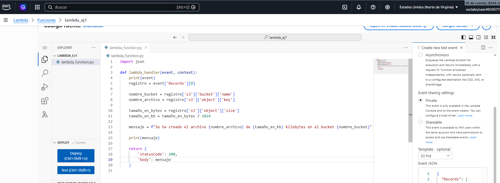


```python
import boto3

try:
    s3 = boto3.client('s3')
    buckets = s3.list_buckets()
    print("Conexion exitosa")
    print(f"Tienes {len(buckets['Buckets'])} buckets en tu cuenta")
except Exception as e:
    print("Error de conexión. Revisa tus credenciales.")
    print(e)
```

    Conexion exitosa
    Tienes 2 buckets en tu cuenta


```python
respuesta= s3.list_buckets()

# Recorremos la lista de diccionarios que nos da AWS
for bucket in respuesta['Buckets']:
    nombre = bucket['Name']
    print(f"Nombre del bucket: {nombre}")
```

    Nombre del bucket: aws-logs-211125762907-us-east-1
    Nombre del bucket: cag-iessanandres-bd-ia


```python
bucket_name="cag-bd-iessanandres-practicas-ut6"
s3.create_bucket(Bucket=bucket_name)

```


    {'ResponseMetadata': {'RequestId': 'S5X8HFXM39CHCJ92',
      'HostId': 'BNJY/DafxtP5TawHrrfsU/zDjuCS2pKun9WL936O7zTJHrTHJ+yufcsetV8NbnKm151nynu7dVJOKueXK77QKopwp9Pxplu1',
      'HTTPStatusCode': 200,
      'HTTPHeaders': {'x-amz-id-2': 'BNJY/DafxtP5TawHrrfsU/zDjuCS2pKun9WL936O7zTJHrTHJ+yufcsetV8NbnKm151nynu7dVJOKueXK77QKopwp9Pxplu1',
       'x-amz-request-id': 'S5X8HFXM39CHCJ92',
       'date': 'Tue, 28 Apr 2026 19:34:10 GMT',
       'location': '/cag-bd-iessanandres-practicas-ut6',
       'x-amz-bucket-arn': 'arn:aws:s3:::cag-bd-iessanandres-practicas-ut6',
       'content-length': '0',
       'server': 'AmazonS3'},
      'RetryAttempts': 0},
     'Location': '/cag-bd-iessanandres-practicas-ut6',
     'BucketArn': 'arn:aws:s3:::cag-bd-iessanandres-practicas-ut6'}


- Agregamos un desencadenador(S3) a la función lambda

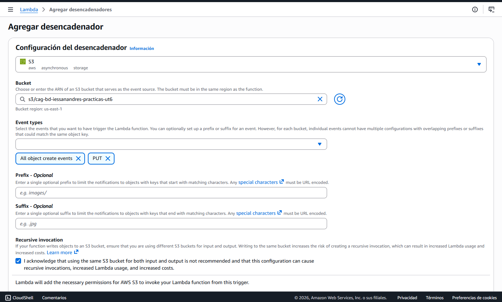


```python
# bucket_name="cag-bd-iessanandres-practicas-ut6"
# Subimos un archivo a S3 para comprobar
s3.upload_file('playas.csv',bucket_name,"prueba/playas.csv")
print("Archivo descargado con exito")
```

    Archivo descargado con exito


- Revisamos en CloudWatch que funcione correctamente y nos llegue el mensaje

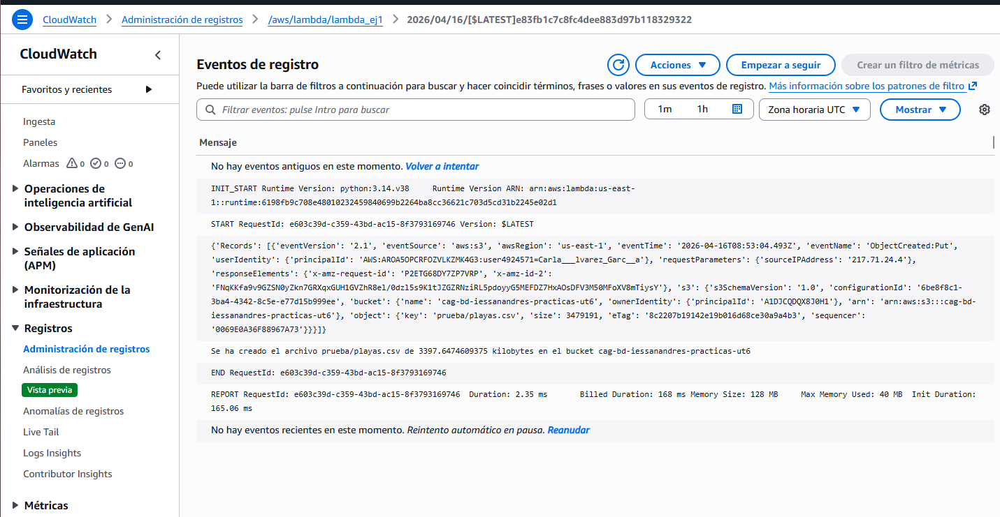

## Ejercicio 2

Crea una función que se dispare cuando llegue un mensaje a la cola `MiBuzon`. La función debe imprimir: 

```
He leído el mensaje: {contenido_del_mensaje}".
```

- Creamos la cola `MiBuzon` en SQS

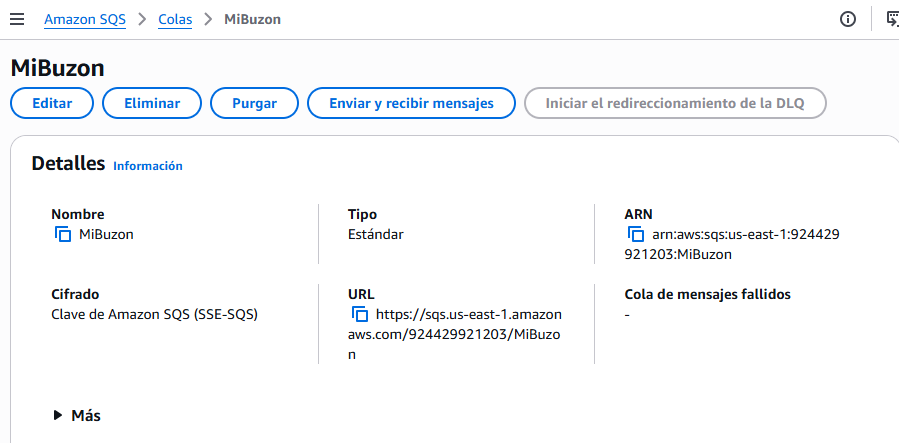

- Creamos la funcion lambda

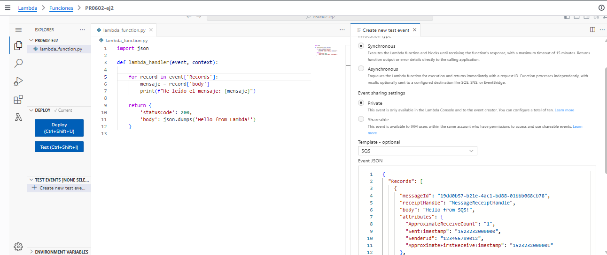

- Agregar desencadenador(SQS) con la cola `MiBuzon`

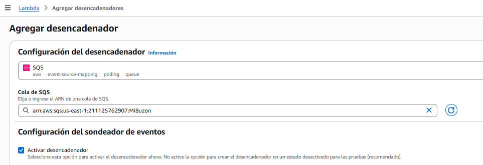

- Enviar un mensaje manualmente

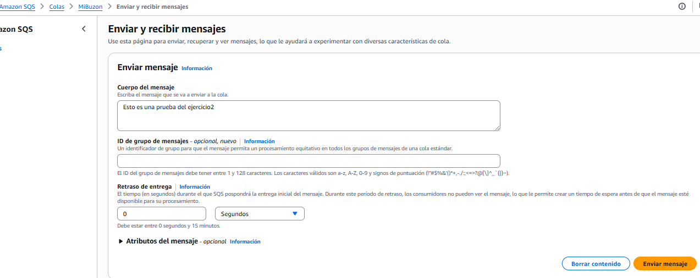

- Comprobar en CloudWatch que nos ha llegado el mennsaje

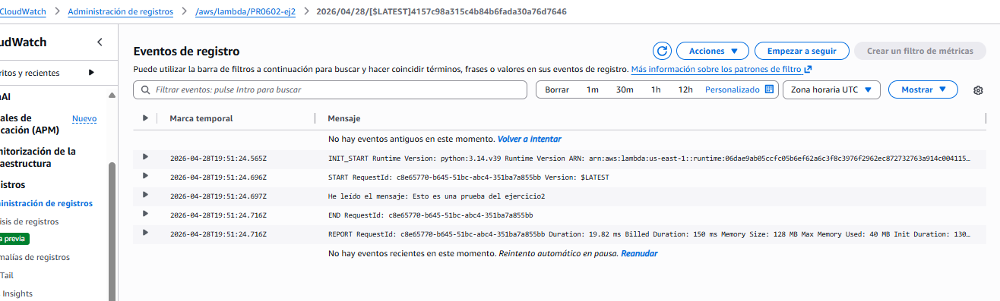

## Ejercicio 3

Modifica el primer ejercicio. Ahora, en lugar de imprimir solo por pantalla, la Lambda debe enviar los datos del archivo (nombre y tamaño) como un mensaje a una cola SQS llamada `ColaDeProcesamiento`


- Creamos una cola en SQS llamada `ColaDeProcesamiento`

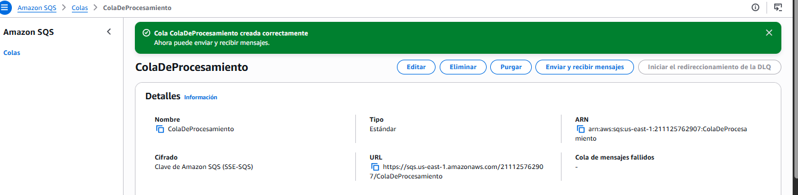

- Modificamos la funcion PR0602-ej1 para añadir como destino del mensaje la cola de SQS ` ColaDeProcesamiento`

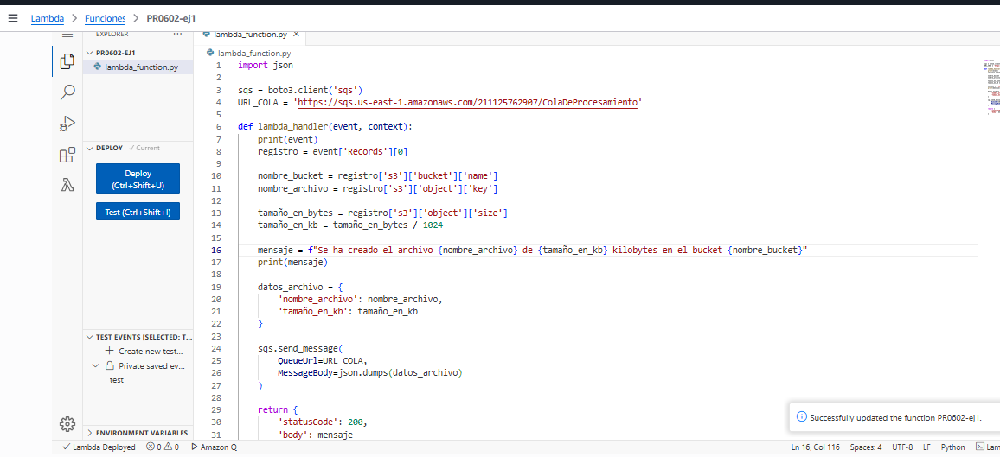


```python
# bucket_name="cag-bd-iessanandres-practicas-ut6"
# Subimos un archivo a S3 para comprobar
s3.upload_file('playas.csv',bucket_name,"prueba/playas.csv")
print("Archivo descargado con exito")
```

    Archivo descargado con exito


- Comprobar en CloudWatch que nos ha llegado el mensaje

 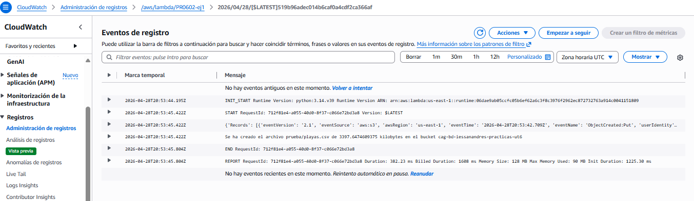

- Comprobar en la cola que el mensaje ha llegado

 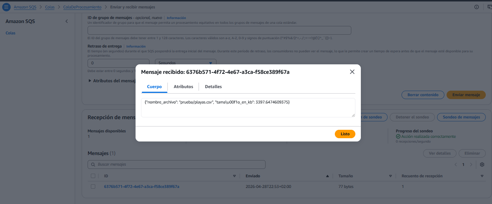


## Ejercicio 4

Envía un JSON a una cola SQS que contenga un campo `prioridad` y otro `mensaje`. Si la prioridad es `ALTA`, la Lambda debe imprimir: `¡PROCESANDO URGENTE: {mensaje}!`. Si es `BAJA`, debe imprimir: `Registro guardado para después`.

Para enviar manualmente un mensaje a una cola simplemente debes ir a `Enviar y recibir mensajes` de la propia     }


- Creamos una cola en SQS llamada `ColaDePrioridades`

 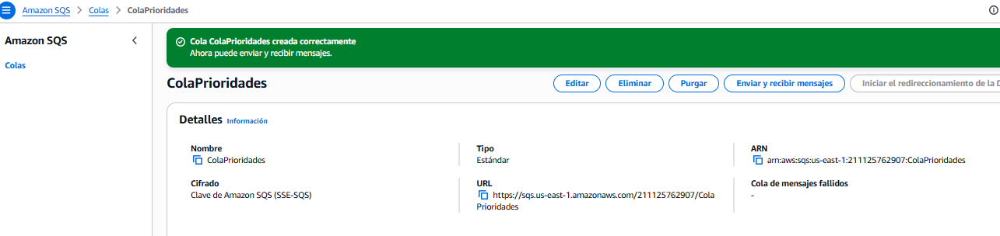

- Creamos la funcion lambda PR0602-j4

 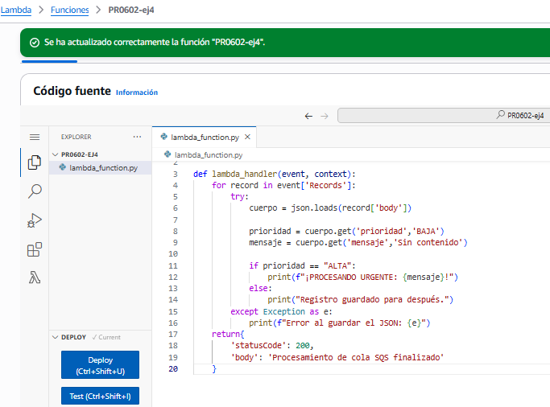

- Agregamos un desencadenador(SQS) a la función

 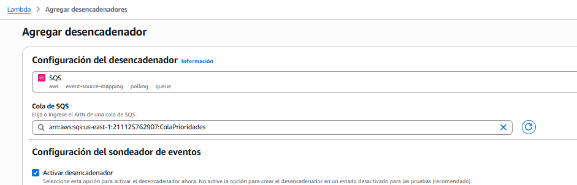

- Enviamos un mensaje(JSON) manualmente `{"prioridad": "ALTA", "mensaje": "Fallo en servidor"}`
 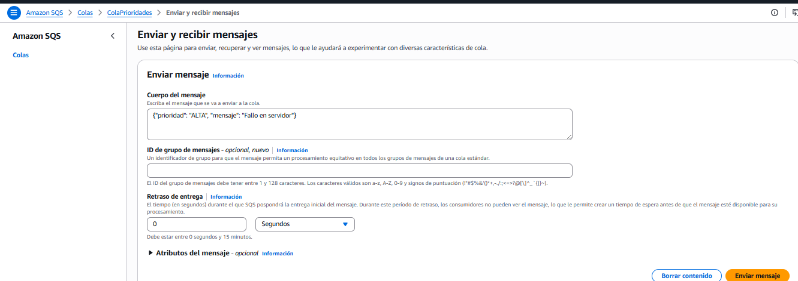

- Comprobar en CloudWatch que nos ha llegado el mensaje

 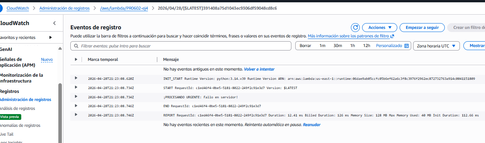

## Ejercicio 5

Rehaz el ejercicio anterior enviando el mensaje desde un script Python en tu equipo. 

A continuación tienes un ejemplo de código sobre cómo enviar un mensaje a una cola.

```python
import boto3

# Creamos el cliente de SQS
sqs = boto3.client('sqs')

# Definimos la URL de la cola
queue_url = 'URL_de_la_cola'

# Creamos un diccionario (JSON) con los datos
datos_archivo = {
    # Contenido del JSON
}

# Serializamos el diccionario
mensaje_serializado = json.dumps(datos_archivo)

# Enviamos el mensaje
response = sqs.send_message(
    QueueUrl=queue_url,
    MessageBody=mensaje_serializado
)
```


```python
import boto3
import json

# Crear el cliente SQS
sqs = boto3.client('sqs', region_name='us-east-1')

# Definir la url de la cola
queue_url = "https://sqs.us-east-1.amazonaws.com/211125762907/ColaPrioridades"

# Crear un diccionario de datos (JSON) para enviarlo
datos = {
    "prioridad": "ALTA",
    "mensaje": "Esto es una prueba"
}
# Serializar el mensaje
mensaje=json.dumps(datos)

# Envio
sqs.send_message(
    QueueUrl=queue_url,
    MessageBody=mensaje
)

print("Mensaje enviado")

```

    Mensaje enviado


- Comprobar en CloudWatch que nos ha llegado el mensaje

 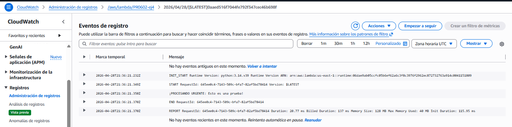

## Ejercicio 6

Crea una función Lambda que se ejecute todos los días a las 08:40 h que muestre el mensaje `Bienvenido a un nuevo día de clase`


- Creamos la funcion lambda PR0602-Ej6

 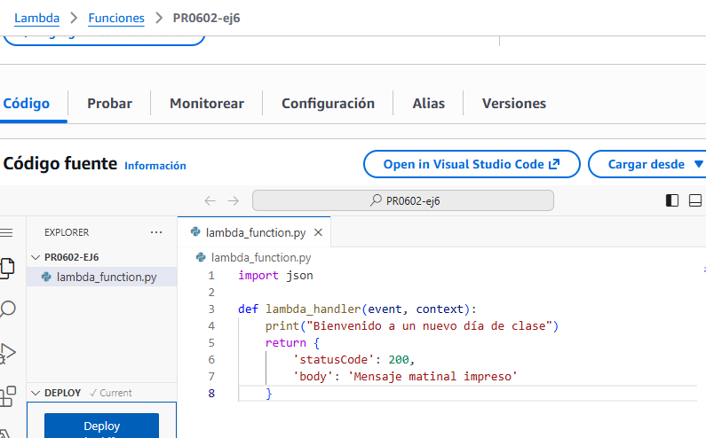

- Agregamos desencadenador(EventBridge) y creamos una regla

 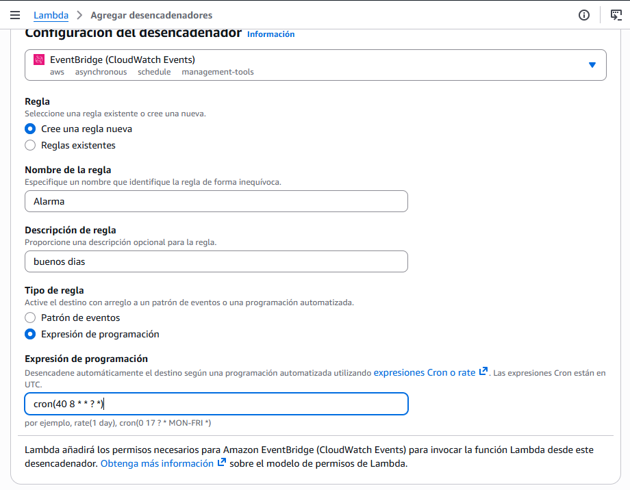

- Hacemos un test para poder comprobar que funciona

 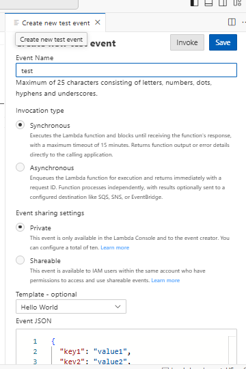

- Comprobar en CloudWatch que nos ha llegado el mensaje

 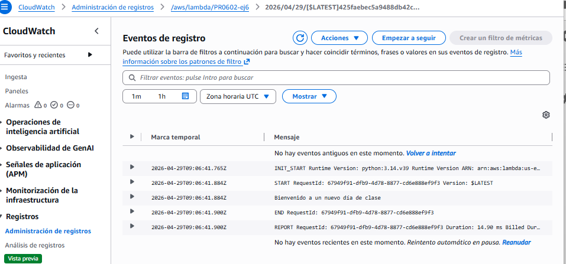

- IMPORTANTE: Eliminar el desencadenador si no lo vamos a usar para evitar gastos

 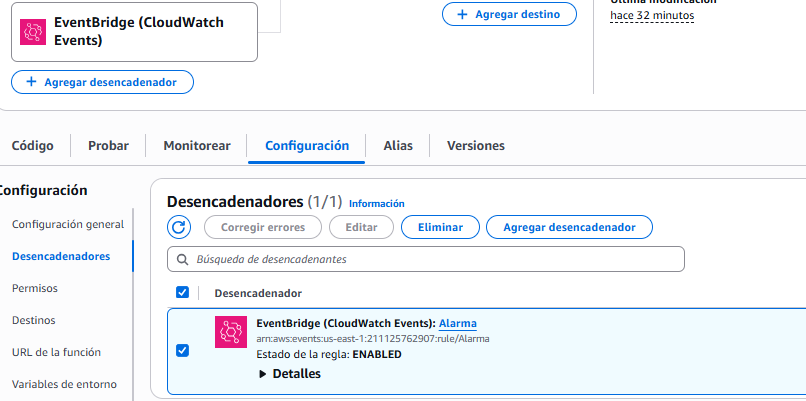

## Ejercicio 7

Crea una función Lambda que se ejecute todos los días y que imprima el número de archivos que hay en un bucket (puedes usar algún bucket que tengas creado por ahí). Recuerda que para obtener el listado de archivos de un bucket debes usar la función `list_objects_v2`


- Creamos la funcion lambda PR0602-Ej7

 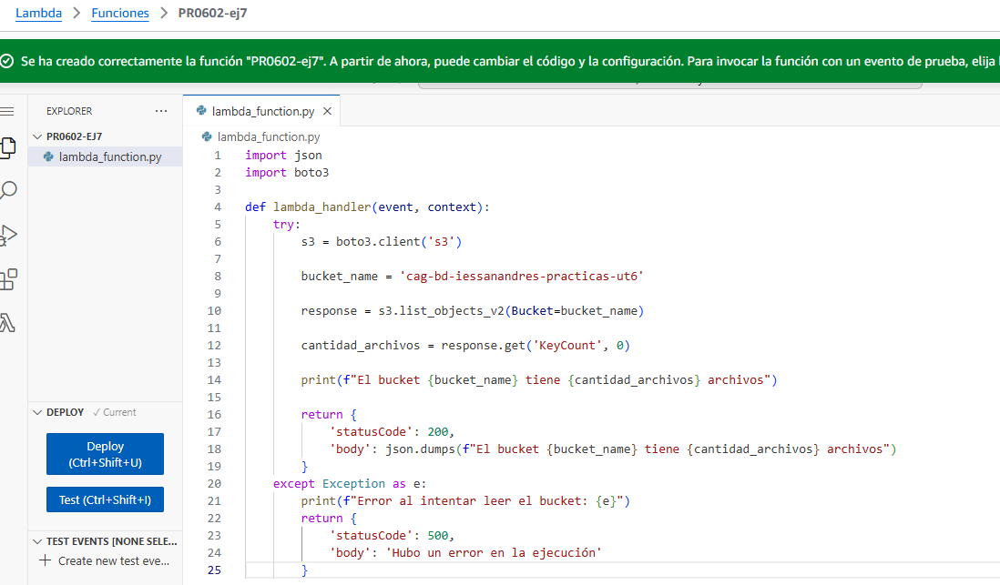

- Agregamos desencadenador(EventBridge) y creamos una regla

 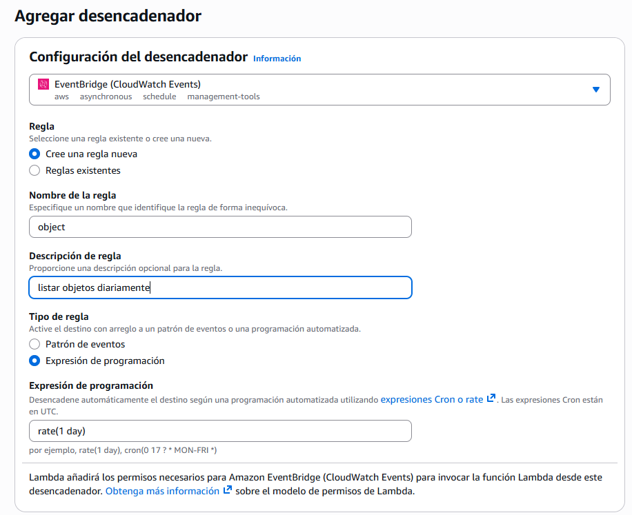

- Hacemos un test para poder comprobar que funciona

 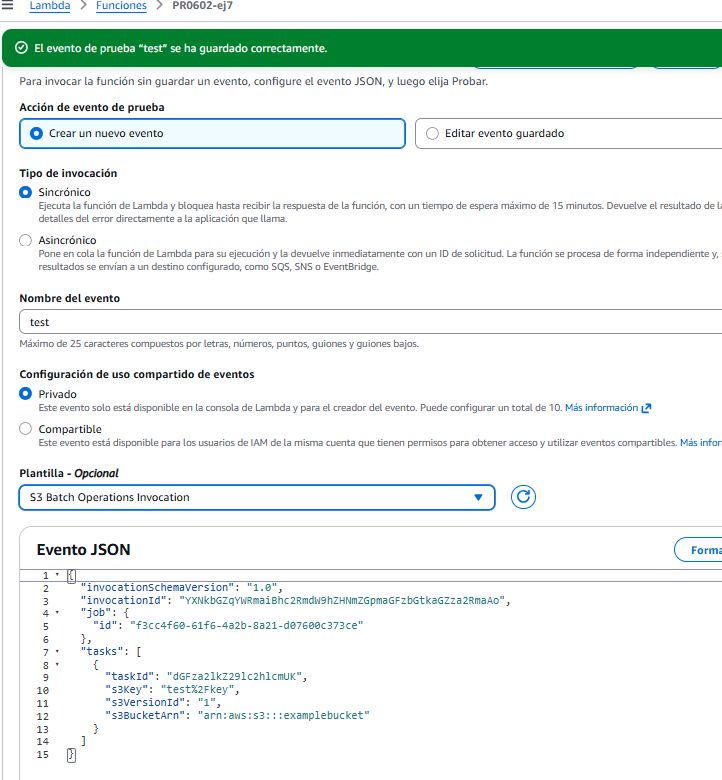

- Comprobar en CloudWatch que nos ha llegado el mensaje

 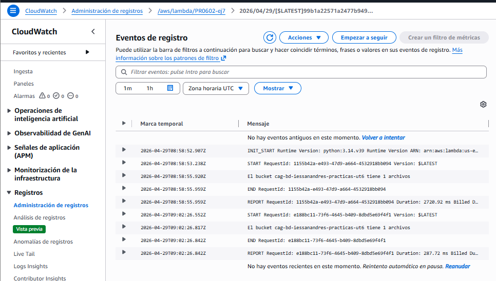

- IMPORTANTE: Eliminar el desencadenador si no lo vamos a usar para evitar gastos

 

## Ejercicio 8

Vamos a convertir la función Lambda del primer ejercicio en un *productor de mensajes*. La idea es que, cada vez que se suba un archivo a S3 ejecute esta función, la cual extraerá los datos que queremos del archivo y los enviará en un mensaje a una cola.

Las tareas que tienes que realizar son:

- **Crear la Cola (SQS)**: crea una cola estándar llamada `ColaDeProcesamiento`.
- **Modificar la función Lambda**: crea una Lambda que capture el nombre y el tamaño del archivo, la función debe enviar un mensaje a la cola SQS con el siguiente formato de texto: `Archivo registrado: {nombre_archivo} | Tamaño: {tamaño_en_kb} KB`
- **Prueba de integración**: sube un archivo al bucket de S3. Esto disparará la Lambda, la cual enviará el mensaje a la cola.
- **Verificación en SQS**: ve a la consola de SQS, selecciona tu cola y pulsa en `Enviar y recibir mensajes`  y verifica que el mensaje con los datos correctos ha llegado al buzón.

- Creamos una cola en SQS llamada `ColaDeProcesamiento`


```python
# bucket_name="cag-bd-iessanandres-practicas-ut6"
# Subimos un archivo a S3 para comprobar
s3.upload_file('playas.csv',bucket_name,"prueba/playas.csv")
print("Archivo descargado con exito")
```

    Archivo descargado con exito

- Modificamos la funcion PR0602-ej1 para añadir como destino del mensaje la cola de SQS ` ColaDeProcesamiento`


- Comprobar en CloudWatch que nos ha llegado el mensaje

 

- Comprobar en la cola que el mensaje ha llegado

 


```python

```
