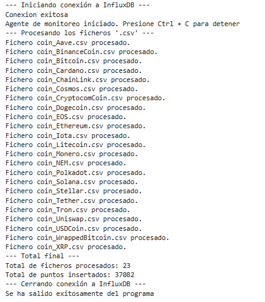

# PR0206: Ingesta de datos financieros en InfluxDB
Para realizar esta práctica tienes que tener en cuenta lo siguiente:

- Nombre del bucket: `crypto_raw`.
- Measurement: `daily_quote`

Y Mapearás las siguientes columnas del fichero CSV. 

| Columna Original    | Columna InfluxDB      | Tipo de Dato | Rol InfluxDB  | Razón |
| :------------------ | :-------------------- | :----------- | :------------ | :--- |
| **Symbol**          | `symbol`              | STRING       | **TAG**       | Clave primaria para filtrar y agrupar por activo. |
| **Name**            | `name`                | STRING       | **TAG**       | Nombre completo (para claridad). |
| **Date**            | `date`                | STRING       | **TIMESTAMP** | Eje temporal del punto. |
| **Close**           | `close`               | FLOAT        | **FIELD**     | Precio de cierre (valor para promediar). |
| **High, Low, Open** | `high`, `low`, `open` | FLOAT        | **FIELD**     | Rango de precios. |
| **Volume**          | `volume`              | FLOAT        | **FIELD**     | Actividad del mercado. |
| **Marketcap**       | `marketcap`           | FLOAT        | **FIELD**     | Valor total. |


Debes desarrollar el script **`ingesta_crypto.py`** que realice los siguientes pasos:

1.  Usa el módulo `os` para listar los 23 ficheros en el directorio `/data/crypto_files/`.
2.  Configura el `InfluxDBClient` y la `WriteAPI` en **modo Asíncrono (`ASYNCHRONOUS`)** con un tamaño de *batch* definido (p.e. **5000 puntos**).
3.  Inicializa un contador global de puntos insertados.
4.  Dentro del **bucle** de lectura de ficheros (usando el módulo `csv.reader` para manejo de CSV):
    - Omite la primera línea (cabecera) de cada fichero.
    - Asegúrate de convertir los campos (`Close`, `Volume`, `Marketcap`, etc.) `float` antes de ser asignados al `Point`.
    - Por cada fila, construye un objeto `Point` que respete el modelo definido, usando el campo `Date` como el `Timestamp` del punto.
5.  Después de procesar cada fichero, imprime un mensaje (`Ej: Fichero BTC.csv procesado`).
6.  Al finalizar el bucle de ficheros, llamar a **`write_api.close()`** para vaciar los puntos restantes del *buffer* antes de que el script termine.

```python
# -------------------------------
# Importación de librerias
# -------------------------------

import influxdb_client
from influxdb_client.client.write_api import ASYNCHRONOUS
from influxdb_client.client.exceptions import InfluxDBError
from urllib3.exceptions import NewConnectionError
from influxdb_client import Point , WriteOptions
from datetime import datetime, timezone
import os
import csv


# -------------------------------
# Configuración de InfluxDB
# -------------------------------

INFLUX_URL = "http://influxdb2:8086"
INFLUX_TOKEN = "AdminToken123="
INFLUX_ORG = "docs"
INFLUX_BUCKET = "crypto_raw"

print("--- Iniciando conexión a InfluxDB ---")


client = None
try:
    # 1. Inicializar el cliente
    client = influxdb_client.InfluxDBClient(
        url=INFLUX_URL,
        token=INFLUX_TOKEN,
        org=INFLUX_ORG
    )
    print("Conexion exitosa")

    # Opciones asincrónas
    write_options= WriteOptions(
        batch_size=5000, # Agrupa 5000 puntos antes de enviarlos
        write_type=ASYNCHRONOUS
    )

    write_api = client.write_api(write_options=write_options)
    print("Agente de monitoreo iniciado. Presione Ctrl + C para detener")

    # Contador global de puntos insertados y de archivos procesados
    total_points = 0
    total_files = 0
    
    # -------------------------------
    # Directorio de ficheros
    # -------------------------------

    print("--- Procesando los ficheros '.csv' ---")
    dir="./data/crypto_files/"
    files = os.listdir(dir)
    
    for file in files:
        if not file.endswith(".csv"):
            continue
        else:
            total_files +=1
        file_path = os.path.join(dir, file)
        
        # -------------------------------
        # Procesamiento de ficheros
        # -------------------------------
        
        with open(file_path, "r", encoding="utf-8") as f:
            reader = csv.DictReader(f)  # Usa la primera fila como cabecera
            for row in reader:
                try:
                    symbol = row["Symbol"]
                    name = row["Name"]
                    date = row["Date"]
                    
                    # Conversion de datos a float
                    def to_float(value):
                        try:
                            return float(value) if value else None
                        except ValueError:
                            return None
            
                    close = to_float(row.get("Close"))
                    high = to_float(row.get("High"))
                    low = to_float(row.get("Low"))
                    open_ = to_float(row.get("Open"))
                    volume = to_float(row.get("Volume"))
                    marketcap = to_float(row.get("Marketcap"))

                    # Usar el tiempor en formato ISO 8601 para que me permita meterlo en el point
                    date = datetime.strptime(row["Date"], "%Y-%m-%d %H:%M:%S").replace(tzinfo=timezone.utc)
                    # Construcción del Point
                    point = (
                        Point("daily_quote")
                        .tag("symbol", symbol)
                        .tag("name", name)
                        .field("close", close)
                        .field("high", high)
                        .field("low", low)
                        .field("open", open_)
                        .field("volume", volume)
                        .field("marketcap", marketcap)
                        .time(date)
                    )
    
                    # Insertar el punto
                    write_api.write(bucket=INFLUX_BUCKET, org=INFLUX_ORG,record=point)
                    total_points += 1
    
                except Exception as e:
                    print(f"Error procesando fila en {file}: {e}")
    
        print(f"Fichero {file} procesado.")
            
            
except KeyboardInterrupt:
    print("\nPrograma terminado por el usuario.")
    
finally:
    write_api.close()
    print("--- Total final ---")
    print(f"Total de ficheros procesados: {total_files}")
    print(f"Total de puntos insertados: {total_points}")
    print("--- Cerrando conexión a InfluxDB ---")
    print("Se ha salido exitosamente del programa")
```

    --- Iniciando conexión a InfluxDB ---
    Conexion exitosa
    Agente de monitoreo iniciado. Presione Ctrl + C para detener
    --- Procesando los ficheros '.csv' ---
    Fichero coin_Aave.csv procesado.
    Fichero coin_BinanceCoin.csv procesado.
    Fichero coin_Bitcoin.csv procesado.
    Fichero coin_Cardano.csv procesado.
    Fichero coin_ChainLink.csv procesado.
    Fichero coin_Cosmos.csv procesado.
    Fichero coin_CryptocomCoin.csv procesado.
    Fichero coin_Dogecoin.csv procesado.
    Fichero coin_EOS.csv procesado.
    Fichero coin_Ethereum.csv procesado.
    Fichero coin_Iota.csv procesado.
    Fichero coin_Litecoin.csv procesado.
    Fichero coin_Monero.csv procesado.
    Fichero coin_NEM.csv procesado.
    Fichero coin_Polkadot.csv procesado.
    Fichero coin_Solana.csv procesado.
    Fichero coin_Stellar.csv procesado.
    Fichero coin_Tether.csv procesado.
    Fichero coin_Tron.csv procesado.
    Fichero coin_Uniswap.csv procesado.
    Fichero coin_USDCoin.csv procesado.
    Fichero coin_WrappedBitcoin.csv procesado.
    Fichero coin_XRP.csv procesado.
    --- Total final ---
    Total de ficheros procesados: 23
    Total de puntos insertados: 37082
    --- Cerrando conexión a InfluxDB ---
    Se ha salido exitosamente del programa


